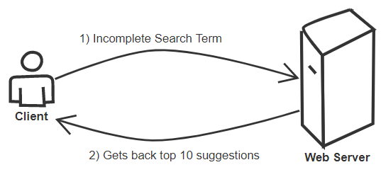
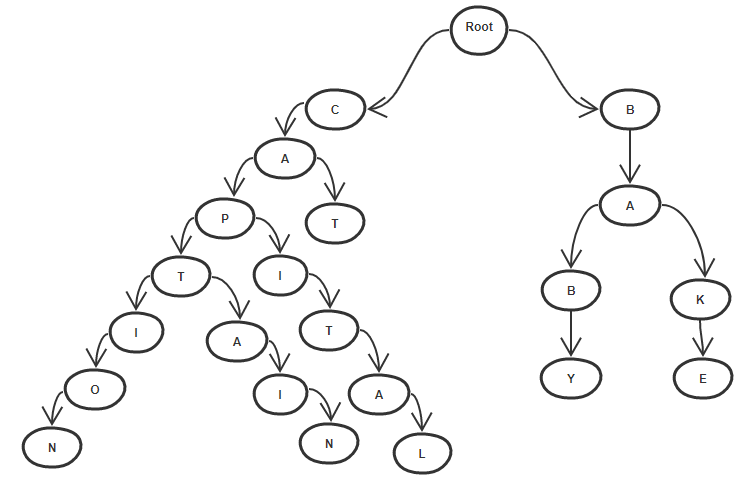
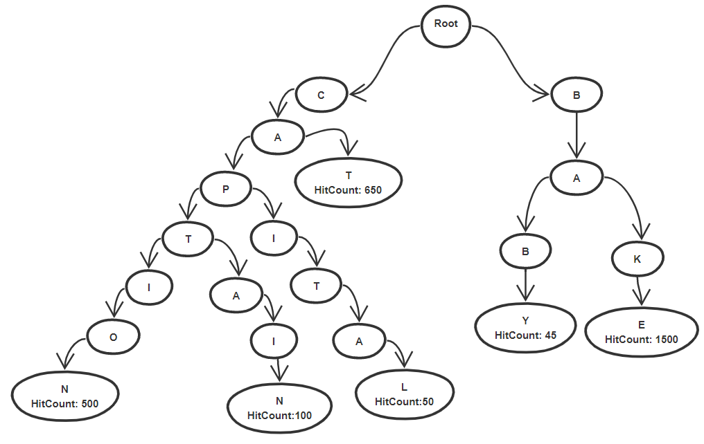
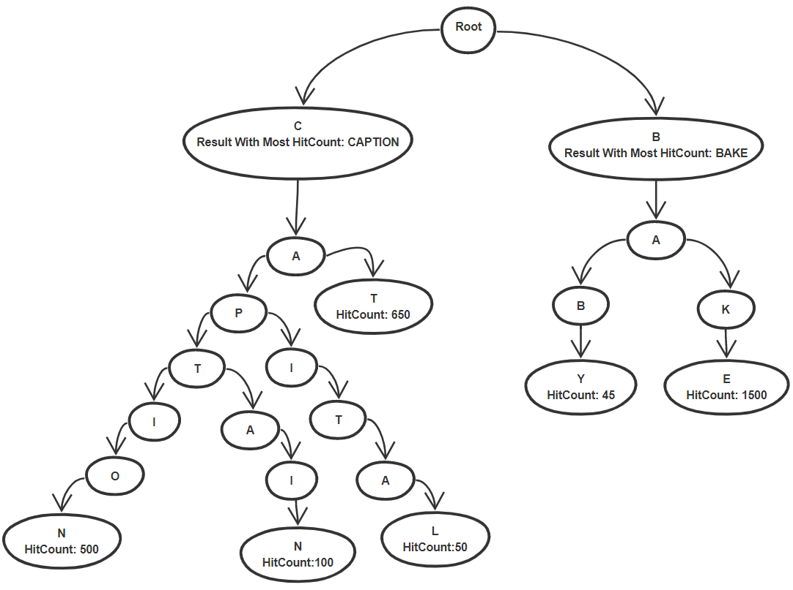
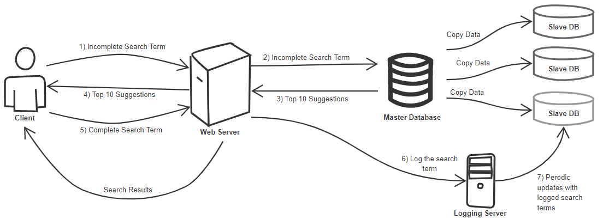
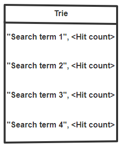
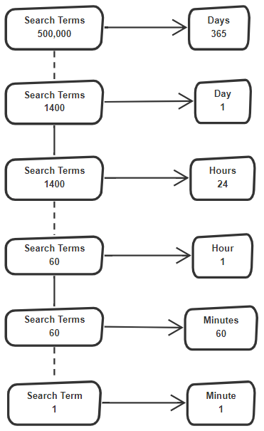

<h1>Auto complete</h1>
<h2>Goals</h2>

Completes the search term the user is typing. 
Need to have low latency  
Suggest the top 10 terms matching the user's query  

  

<h2>Scope</h2>

For now let's focus on single user system.

  

<h2>High Level diagram</h2>

  

<h2>Detailed component design</h2>
We can use a trie for this purpose  
 
 
<h3>How can we find the top suggestions ? </h3>
 
 
<h3>How to speed up top suggestion search ? </h3>
 
We can optimise the above by just storing the references rather than the whole search term. But then again, what is the size of search term vs size of reference ? Is it really worth it ? 
We'd also need to store the hit count along with the search term, so I guess reference can be a better option  
 
<h3>Updating the Trie</h3>
<b>My Thoughts:</b>
Every time we search for something, the hit count changes, we can update that. Also, if you see that the current seach term's hit count is greater than the <i>Result with most hit count</i> (in the top node), then we change that.
 
<b>The internet:</b>
There are too many searches happening, if there are billions of people using this. It would be time consuming to update this every time, we can solve this by doing perodic updates offline.
 
As the new search queries come we log them and then perodically update the Trie offline.
 
So if we implement the <i>master slave architecture</i> in the database, we can just update one of the slaves and then when update is done, we make that slave the new master. And if you remember, according the master slave architecture, when the master gets updated the slaves copy the latest master, so even they get updated.
 
With this our system would look something like this.
 

  

<h3>How do we Serialize and Deserialize Trie</h3>
<b>My Thoughts:</b>
Just do something like what we did <a href = "https://github.com/PriyankaKhire/ProgrammingPracticePython/blob/master/Serialize%20and%20Deserialize%20N-ary%20Tree.py">here.</a> Except there we were just storing values, here we'd need to store other attributes like HitCount, ResultWithMostHitCount etc.
 
Or we can just store all the search terms as a list in a file and then during the time of deserialization we can just rebuild the whole trie again. At the end of each search term we can also store their hit count, but we won't store the top 10 terms, we can just calculate that again on basis of the hit count.
 
So our serialized file would look like this:
 

  

<h2>Capacity estimation</h2>
So let's say we get 2.5 Million Search terms per year. Do we need to store all these search terms ? Some of them might be duplicates as well, let's say only 20% are unique search terms, that we are interested to store. 20% of 2.5 Million is 500,000 search terms per year.
 

 
<b>Storage Requirements:</b>
So if we need to store 500,000 search terms, and each search term is let's assume 50Bytes. 
Then we'd need 500,000 * 50Bytes = 25Mb of space.
  

<h2>Scale the system</h2>
<h3>Data Partitioning</h3>
Horizontal Range based partitioning schemes such as alphabetical partitioning, where we keep all terms starting from letter 'A' on one shard, letter 'B' on another shard and so on, can create unbalenced shards.
  
<b>Partition based on the maximum capacity of shard:</b>
Let's say one shard can hold 100 search terms, and our first 100 search terms start from AAA and end at AAB, then we store these 100 search terms on our first shard, let's say our second 100 search terms are from AAB-DAA, then second shard can hold those.
 
Basically we are just taking first 100 search terms and keeping them on first shard, then next 100 on next shard and so on.
 
After this we can have a hash table that holds this info. Where key is shard number and value is alphabet range like AAA-AAB.
 
But what if the data of Just letter A is split between 5 shards ?
 
In that case we may have to perform a join operation to join the data from all the 5 shards and then give the top 10 from there.
 
Or we can only start suggesting after certain letters are typed, this way narrowing down the shards we'd need to search.
 
Another way to go about this is adding another layer of server between the shards, so when user types A it goes to server that handles only letter A and gathers data from 5 underlying shards.
 
But what if there is a 'HOT TERM' that starts with A, then that server handeling the 'A' requests will be overwhelmed.
  

<h3>Cache</h3>
We can have a cache on database server side that holds the top searched terms.
 
On Main Server side, we can have a cache that holds the top terms from the database caches.
