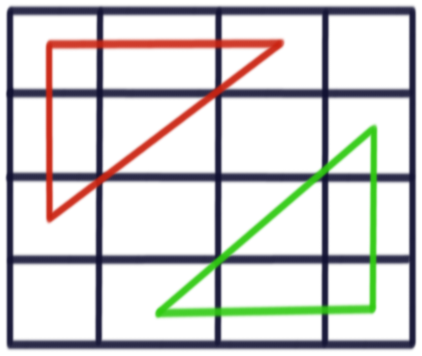

<h1>Blind 75</h1>
  <a href="https://leetcode.com/discuss/general-discussion/460599/blind-75-leetcode-questions">Leetcode link to the post.</a>
  <h4>Total Completed: 31</h4>
  <h2>Array (Solved: 4, Unsolved: 6)</h2>
    <ul>
      <li><a href="Programs/Two Sum.py">Two Sum</a> 
        
<b>Approach</b>: Solved using hash table, you can even solve this using 2 pointer approach where you'd have to sort the array, but then you won't be able to return index. 

      </li>
      <li> Three Sum
      <ol>
        <li><a href="Programs/Three Sum - ForLoops.py">Solved using 3 for loops</a>: Time complexity O(n^3), Leetcode time limit exceeded. </li>
        <li><a href="Programs/Three Sum - Recursion.py">Solved using Recursion</a>: Leetcode time limit exceeded. </li>
        <li><a href="Programs/Three Sum - 2 Pointer.py">Solved using 2 pointers and a for loop</a>: Time Complexity O(n^2), Leetcode accepted.</li>
      </ol>
      </li>
      <li> <a href="Programs/Container With Most Water.py">Container With Most Water</a>
        
 <b>Approach</b>: 2 Pointers to keep track of left and right poles.
        

      </li>
      <li><a href="Programs/Best Time to Buy and Sell Stock.py">Best Time to Buy and Sell Stock</a>
        
 <b>Approach</b>: O(n) approach, just keep track of lowest on left and compare with current price. 

      </li>
      <li>Contains Duplicate</li>
      <li>Product of Array Except Self</li>
      <li>Maximum Subarray</li>
      <li>Maximum Product Subarray</li>
      <li>Find Minimum in Rotated Sorted Array</li>
      <li>Search in Rotated Sorted Array</li>
    </ul>
  <h2>Binary (Solved: 1, Unsolved: 4)</h2>
    <ul>
      <li><a href="Programs/Sum of Two Integers.py">Sum of Two Integers</a> 
        
<b>Approach</b>: We can add 2 integers without using any arithmetic operator by using half adder. 
            
          We need XOR for sum and AND for carry.  
          This is the truth table for it.  
          <table>
            <tr>
              <th>a + b</th>
              <th>carry</th>
              <th>sum</th>
            </tr>
            <tr>
              <td>0 + 0</td>
              <td>0</td>
              <td>0</td>
            </tr>
            <tr>
              <td>0 + 1</td>
              <td>0</td>
              <td>1</td>
            </tr>
            <tr>
              <td>1 + 0</td>
              <td>0</td>
              <td>1</td>
            </tr>
            <tr>
              <td>1 + 1</td>
              <td>1</td>
              <td>0</td>
            </tr>
          </table>
          Here's a catch though, when you AND 01 with 01 it gives you 01.  
          So how do you implement 1 ADDER 1 = 10 by using LEFT SHIFT <<   
          Similarly we can subtract 2 numbers with the help of half subtractor.  
            
          We need XOR for the difference but we need to compliment part of the carry. 
          This is the truth table for it. 
          <table>
            <tr>
              <th>a - b</th>
              <th>borrow</th>
              <th>difference</th>
            </tr>
            <tr>
              <td>0 - 0</td>
              <td>0</td>
              <td>0</td>
            </tr>
            <tr>
              <td>0 - 1</td>
              <td>1</td>
              <td>1</td>
            </tr>
            <tr>
              <td>1 - 0</td>
              <td>0</td>
              <td>1</td>
            </tr>
            <tr>
              <td>1 - 1</td>
              <td>0</td>
              <td>0</td>
            </tr>
          </table>
          We use similar logic that we used for half adder above and get subtraction.
        

      </li>
      <li>Number of 1 Bits</li>
      <li>Counting Bits</li>
      <li>Missing Number</li>
      <li>Reverse Bits</li>
    </ul>
  <h2>Dynamic Programming (Not started this)</h2>
    <ul>
      <li>Climbing Stairs</li>
      <li>Coin Change</li>
      <li>Longest Increasing Subsequence</li>
      <li>Longest Common Subsequence</li>
      <li>Word Break Problem</li>
      <li>Combination Sum</li>
      <li>House Robber</li>
      <li>House Robber II</li>
      <li>Decode Ways</li>
      <li>Unique Paths</li>
      <li>Jump Game</li>
    </ul>
  <h2>Graph (Solved: 4, Unsolved: 4)</h2>
    <ul>
      <li><a href="Programs/Clone Graph.py">Clone Graph</a>
        
<b>Approach</b>: Used both dfs and bfs to copy the graph. Leetcode accepted.

      </li>
      <li><a href="Programs/Course Schedule.py">Course Schedule</a>
        
<b>Approach</b>: Used BFS topological sort. Understood the approach from <a href="https://leetcode.com/discuss/general-discussion/1078072/introduction-to-topological-sort">this article</a>. 
          The following pseudo code helped.  
          <pre><code>
            L = Empty list that will contain the sorted elements  
            S = Set of all nodes with no incoming edge  
             
              While S is non-empty do:  
                &ensp; remove a node n from S  
                &ensp; add n to tail of L  
                &ensp; for each node m with an edge e from n to m do  
                  &ensp; &ensp; remove edge e from the graph  
                  &ensp; &ensp; if m has no other incoming edges then  
                    &ensp; &ensp; &ensp; insert m into S  
               
              if graph has edges then  
                &ensp; return error   (graph has at least one cycle)  
              else  
                &ensp; return L   (a topologically sorted order)  
          </code></pre>
        

      </li>
      <li><a href="Programs/Pacific Atlantic Water Flow.py">Pacific Atlantic Water Flow</a>
        
<b>Approach</b>: Variation of island problem, solved using DFS. Can be solved using BFS

      </li>
      <li><a href="Programs/Number of Islands.py">Number of Islands</a> 
        
<b>Approach</b>: Solved using DFS

      </li>
      <li>Longest Consecutive Sequence</li>
      <li>Alien Dictionary</li>
      <li>Graph Valid Tree</li>
      <li>Number of Connected Components in an Undirected Graph</li>
    </ul>
  <h2>Interval (Not started this)</h2>
    <ul>
      <li>Insert Interval</li>
      <li>Merge Intervals</li>
      <li>Non-overlapping Intervals</li>
      <li>Meeting Rooms</li>
      <li>Meeting Rooms II</li>
    </ul>
  <h2>Linked List (Solved all)</h2>
    <ul>
      <li><a href="Programs/Reverse Linked List.py">Reverse Linked List</a>
        
<b>Approach</b>: Used 3 pointer approach 

      </li>
      <li><a href="Programs/Linked List Cycle.py">Linked List Cycle</a>
        
<b>Approach</b>: Used rabbit and tortoise method, where we move rabbit by 2 positions and tortoise by 1. 
          If at any given point the 2 meet then we got a cycle. 
          You can also solve this porblem by having a hash table and making note of all the nodes seen so far. 
        

      </li>
      <li><a href="Programs/Merge Two Sorted Lists.py">Merge Two Sorted Lists</a>
        
<b>Approach</b>: Simple O(n) merging, by traversing both lists at the same time.
        

      </li>
      <li><a href="Programs/Merge K sorted Lists.py">Merge K Sorted Lists</a> 
        
<b>Approach</b>: Use heap sort to merge k lists.
        

      </li>
      <li><a href="Programs/Remove Nth Node From End of List.py">Remove Nth Node From End Of List</a> 
        
<b>Approach</b>: Use rabbit and tortoise method. Move rabbit n spaces, then move tortoise along with rabbit unitl rabbit reaches end of the list.
        

      </li>
      <li><a href="Programs/Reorder List.py">Reorder List</a> 
      
<b>Approach</b>: Detached list in the middle using rabbit and tortoise method. 
        Put the second list in stack and detached it's nodes. 
        Traversed the first list and added the stack nodes in between.
        Total time O(n), space O(n/2)
      

      </li>
    </ul>
  <h2>Matrix (Solved all)</h2>
    <ul>
      <li><a href="Programs/Set Matrix Zeroes.py">Set Matrix Zeroes</a> 
        
<b>Approach</b>: Set the row and col of the cell with zero to value "x". 
          Then in second pass, change all the cells with "x" to zero.
          This ensures we use no extra space and do it in O(n) time.
        

      </li>
      <li><a href="Programs/Spiral Matrix.py">Spiral Matrix</a> 
        
<b>Approach</b>: Had to see this idea from leetcode solutions.  
          First write a function that first prints the spiral of rows and cols, then just reduce the bounds and do the same.  
          Don't forget the mark the cells visited to avoid duplicates.
        

      </li>
      <li><a href="Programs/Rotate Image.py">Rotate Image</a> 
        
<b>Approach</b>: First swap the elements under red triangle with the green triangle. 
           
          Then flip the matrix upside down.
        

      </li>
      <li><a href="Programs/Word Search.py">Word Search</a> 
        
<b>Approach</b>: Similar to island problem, dfs and backtracking for visited cells.  
          Make sure to check if all the letters in the word are present on the board before proceeding to find the word.
        

      </li>
    </ul>
  <h2>String (Solved: 2, Unsolve: 8)</h2>
    <ul>
      <li><a href="Programs/Longest%20Substring%20Without%20Repeating%20Characters.py">Longest Substring Without Repeating Characters</a>  
        
<b>Approach</b>: We use sliding window for this one. Use hash table to keep track of the letters in the window.

      </li>
      <li><a href="Programs/Longest Repeating Character Replacement.py">Longest Repeating Character Replacement</a> 
        
<b>Approach</b>: Following formula used  
          (length of substring - number of times of the maximum occurring character in the substring) <= k  
        

      </li>
      <li>Minimum Window Substring</li>
      <li><a href="Programs/Valid Anagram.py">Valid Anagram</a> 
        
<b>Approach</b>: Used hash table.
        

      </li>
      <li>Group Anagrams</li>
      <li>Valid Parentheses</li>
      <li>Valid Palindrome</li>
      <li>Longest Palindromic Substring</li>
      <li>Palindromic Substrings</li>
      <li>Encode and Decode Strings (Leetcode Premium)</li>
    </ul>
  <h2>Tree (Solved: 8, Unsolved: 6)</h2>
    <ul>
      <li><a href="Programs/Maximum Depth of Binary Tree.py">Maximum Depth of Binary Tree</a>
        
<b>Approach</b>: done using simple (any)-order traversal.

      </li>
      <li><a href="Programs/Same Tree.py">Same Tree</a>
        
<b>Approach</b>: do any 2 traversals and compare them. I did in-order and post-order.

      </li>
      <li><a href="Programs/Invert Binary Tree.py">Invert/Flip Binary Tree</a>
        
<b>Thoughts</b>: My initial thought was to do level order traversal and then flip the nodes. But this approach was unnecessarily complicated.  
          <b>Approach</b>: Perform a post-order traversal and flip left and right child of each node. What this creates is that even if you flip 1 node at a time, since you'll be flipping their parent too, all the nodes get flipped automatically.
        

      </li>
      <li><a href="Programs/Binary Tree Maximum Path Sum.py">Binary Tree Maximum Path Sum</a>
        
<b>Approach</b>: It's pretty similar to finding height of a tree. The only catch is what to return.

      </li>
      <li><a href="Programs/Binary Tree Level Order Traversal.py">Binary Tree Level Order Traversal</a>
        
<b>Approach</b>: Used a modified iterative BFS

      </li>
      <li><a href="Programs/Serialize and Deserialize Binary Tree - PreOrder.py">Serialize and Deserialize Binary Tree</a> 
        
<b>Approach</b>: Use preorder to serialize it using comma as delimiter.  
          Then use similar method we use to find height of tree to first add left child of sub tree and then add right child of sub tree, all while traversing the array.
        

        
<b>Thoughts</b>: Initially I thought of using tries to do this, but it can create problems if all nodes of the tree have same value.  
          My next thought was to do inOrder and preOrder traversal and then build the tree, but I was plagued by the same above problem, what if all tree nodes have same value.  
          Then I thought about level order traversal but use delimiter for null nodes, this will waste a LOT of space (what if the tree is skewed), but I will end up with correct answer.  
        

        <ul>
          <li><a href="Programs/Serialize and Deserialize Binary Tree - LevelOrder Toomuch Space.py">Too much space with level order</a>: This exceeded leetcode space limit. </li>
        </ul>
      </li>
      <li><a href="Programs/Subtree of Another Tree.py">Subtree of Another Tree</a>
        
<b>Approach</b>: Recursive function similar to inorder traversal that checks if 2 sub trees are same or not.
          Another function that checks if the current node in the larger tree is same as the root of sub tree, then it calls the previous function to check if the subtrees are same or not.
        

      </li>
      <li>Construct Binary Tree from Preorder and Inorder Traversal</li>
      <li><a href="Programs/Validate Binary Search Tree.py">Validate Binary Search Tree</a>
        
<b>Approach</b>: Do an inorder traversal of the BST.  
          Then validate if the traversal is in ascending order or not. 
        

      </li>
      <li><a href="Programs/Kth Smallest Element in a BST.py">Kth Smallest Element in a BST</a> 
        
<b>Approach</b>: User inorder traversal to find the kth smallest element.
        

      </li>
      <li><a href="Programs/Lowest Common Ancestor of a Binary Search Tree.py">Lowest Common Ancestor of a Binary Search Tree</a>
        
<b>Approach</b>: First search for the nodes in left sub tree, and right sub tree. If found return the root.  
           Don't forget to trickle the answer upwards if nothing is found. Approach similar to postOrder traversal of the tree.
        

      </li>
      <li><a href="Programs/Implement Trie.py">Implement Trie (Prefix Tree)</a>
        
<b>Thoughts</b>: You can also use this approach to serialise and de-serialise an n-ary tree.

      </li>
      <li><a href="Programs/Design Add and Search Words Data Structure.py">Add and Search Word</a>
        
<b>Approach</b>: Use trie for this.
        

      </li>
      <li>Word Search II</li>
    </ul>
  <h2>Heap (Solved all)</h2>
    <ul>
      <li><a href="Programs/Merge K sorted Lists.py">Merge K Sorted Lists</a> </li>
      <li><a href="Programs/Top K Frequent Elements.py">Top K Frequent Elements</a> 
        
<b>Approach</b>: First build a hash table with key: element, value: frequency. 
          Then Create a heap and add all elements from the hash to the heap in form of tuple (python thing). 
          Remove the top k elements from the heap.
        

      </li>
      <li><a href="Programs/Find Median from Data Stream.py">Find Median from Data Stream</a> 
        
<b>Approach</b>: Keep 2 heaps, max heap to hold all elements less than median and min heap to hold elements greater than the median.  
          Finding median: which ever heap has more elements, the top element of that heap is the median.  
          If both heaps have same elements, then median is (minHeapTop+maxHeapTop) / 2  
          If at any point one heap has 2 elements more than other heap, pop an element from that heap and add it to another heap.
        

      </li>
    </ul>

