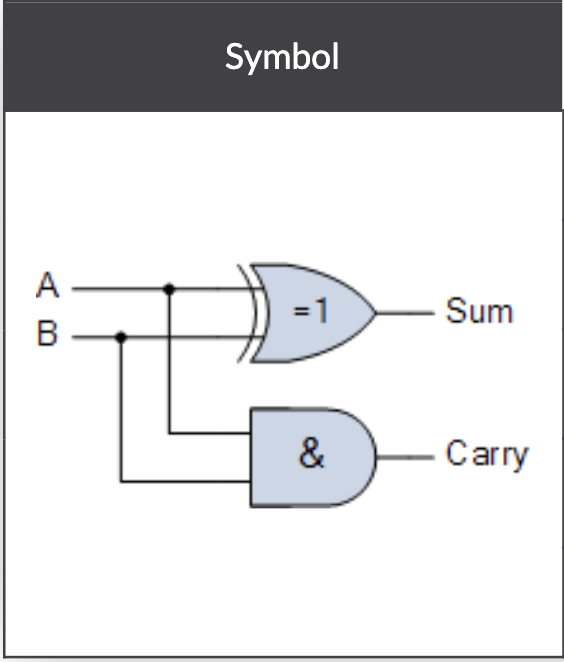
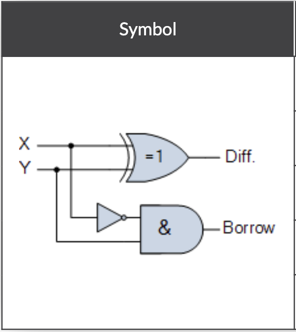

<h1>Blind 75</h1>
  <a href="https://leetcode.com/discuss/general-discussion/460599/blind-75-leetcode-questions">Leetcode link to the post.</a>
  <h2>Array</h2>
    <ul>
      <li><a href="Programs/Two Sum.py">Two Sum</a> 
        
<b>Approach</b>: Solved using hash table, you can even solve this using 2 pointer approach where you'd have to sort the array, but then you won't be able to return index. 

      </li>
      <li> Three Sum
      <ol>
        <li><a href="Programs/Three Sum - ForLoops.py">Solved using 3 for loops</a>: Time complexity O(n^3), Leetcode time limit exceeded. </li>
        <li><a href="Programs/Three Sum - Recursion.py">Solved using Recursion</a>: Leetcode time limit exceeded. </li>
        <li><a href="Programs/Three Sum - 2 Pointer.py">Solved using 2 pointers and a for loop</a>: Time Complexity O(n^2), Leetcode accepted.</li>
      </ol>
      </li>
      <li> <a href="Programs/Container With Most Water.py">Container With Most Water</a>
        
 <b>Approach</b>: 2 Pointers to keep track of left and right poles.
        

      </li>
      <li><a href="Programs/Best Time to Buy and Sell Stock.py">Best Time to Buy and Sell Stock</a>
        
 <b>Approach</b>: O(n) approach, just keep track of lowest on left and compare with current price. 

      </li>
      <li>Contains Duplicate</li>
      <li>Product of Array Except Self</li>
      <li>Maximum Subarray</li>
      <li>Maximum Product Subarray</li>
      <li>Find Minimum in Rotated Sorted Array</li>
      <li>Search in Rotated Sorted Array</li>
    </ul>
  <h2>Binary</h2>
    <ul>
      <li><a href="Programs/Sum of Two Integers.py">Sum of Two Integers</a> 
        
<b>Approach</b>: We can add 2 integers without using any arithmetic operator by using half adder. 
            
          We need XOR for sum and AND for carry.  
          This is the truth table for it.  
          <table>
            <tr>
              <th>a + b</th>
              <th>carry</th>
              <th>sum</th>
            </tr>
            <tr>
              <td>0 + 0</td>
              <td>0</td>
              <td>0</td>
            </tr>
            <tr>
              <td>0 + 1</td>
              <td>0</td>
              <td>1</td>
            </tr>
            <tr>
              <td>1 + 0</td>
              <td>0</td>
              <td>1</td>
            </tr>
            <tr>
              <td>1 + 1</td>
              <td>1</td>
              <td>0</td>
            </tr>
          </table>
          Here's a catch though, when you AND 01 with 01 it gives you 01.  
          So how do you implement 1 ADDER 1 = 10 by using LEFT SHIFT <<   
          Similarly we can subtract 2 numbers with the help of half subtractor.  
            
          We need XOR for the difference but we need to compliment part of the carry. 
          This is the truth table for it. 
          <table>
            <tr>
              <th>a - b</th>
              <th>borrow</th>
              <th>difference</th>
            </tr>
            <tr>
              <td>0 - 0</td>
              <td>0</td>
              <td>0</td>
            </tr>
            <tr>
              <td>0 - 1</td>
              <td>1</td>
              <td>1</td>
            </tr>
            <tr>
              <td>1 - 0</td>
              <td>0</td>
              <td>1</td>
            </tr>
            <tr>
              <td>1 - 1</td>
              <td>0</td>
              <td>0</td>
            </tr>
          </table>
          We use similar logic that we used for half adder above and get subtraction.
        

      </li>
      <li>Number of 1 Bits</li>
      <li>Counting Bits</li>
      <li>Missing Number</li>
      <li>Reverse Bits</li>
    </ul>
  <h2>Dynamic Programming</h2>
    <ul>
      <li>Climbing Stairs</li>
      <li>Coin Change</li>
      <li>Longest Increasing Subsequence</li>
      <li>Longest Common Subsequence</li>
      <li>Word Break Problem</li>
      <li>Combination Sum</li>
      <li>House Robber</li>
      <li>House Robber II</li>
      <li>Decode Ways</li>
      <li>Unique Paths</li>
      <li>Jump Game</li>
    </ul>
  <h2>Graph</h2>
    <ul>
      <li><a href="Programs/Clone Graph.py">Clone Graph</a>
        
<b>Approach</b>: Used both dfs and bfs to copy the graph. Leetcode accepted.

      </li>
      <li><a href="Programs/Course Schedule.py">Course Schedule</a>
        
<b>Approach</b>: Used BFS topological sort. Understood the approach from <a href="https://leetcode.com/discuss/general-discussion/1078072/introduction-to-topological-sort">this article</a>. 
          The following pseudo code helped.  
          <pre><code>
            L = Empty list that will contain the sorted elements  
            S = Set of all nodes with no incoming edge  
             
              While S is non-empty do:  
                &ensp; remove a node n from S  
                &ensp; add n to tail of L  
                &ensp; for each node m with an edge e from n to m do  
                  &ensp; &ensp; remove edge e from the graph  
                  &ensp; &ensp; if m has no other incoming edges then  
                    &ensp; &ensp; &ensp; insert m into S  
               
              if graph has edges then  
                &ensp; return error   (graph has at least one cycle)  
              else  
                &ensp; return L   (a topologically sorted order)  
          </code></pre>
        

      </li>
      <li><a href="Programs/Pacific Atlantic Water Flow.py">Pacific Atlantic Water Flow</a>
        
<b>Approach</b>: Variation of island problem, solved using DFS. Can be solved using BFS

      </li>
      <li><a href="Programs/Number of Islands.py">Number of Islands</a> 
        
<b>Approach</b>: Solved using DFS.f

      </li>
      <li>Longest Consecutive Sequence</li>
      <li>Alien Dictionary</li>
      <li>Graph Valid Tree</li>
      <li>Number of Connected Components in an Undirected Graph</li>
    </ul>
  <h2>Interval</h2>
    <ul>
      <li>Insert Interval</li>
      <li>Merge Intervals</li>
      <li>Non-overlapping Intervals</li>
      <li>Meeting Rooms</li>
      <li>Meeting Rooms II</li>
    </ul>
  <h2>Linked List</h2>
    <ul>
      <li><a href="Programs/Reverse Linked List.py">Reverse Linked List</a>
        
<b>Approach</b>: Used 3 pointer approach 

      </li>
      <li><a href="Programs/Linked List Cycle.py">Linked List Cycle</a>
        
<b>Approach</b>: Used rabbit and tortoise method, where we move rabbit by 2 positions and tortoise by 1. 
          If at any given point the 2 meet then we got a cycle. 
          You can also solve this porblem by having a hash table and making note of all the nodes seen so far. 
        

      </li>
      <li>Merge Two Sorted Lists</li>
      <li>Merge K Sorted Lists</li>
      <li>Remove Nth Node From End Of List</li>
      <li>Reorder List</li>
    </ul>
  <h2>Matrix</h2>
    <ul>
      <li>Set Matrix Zeroes</li>
      <li>Spiral Matrix</li>
      <li>Rotate Image</li>
      <li>Word Search</li>
    </ul>
  <h2>String</h2>
    <ul>
      <li><a href="Programs/Longest%20Substring%20Without%20Repeating%20Characters.py">Longest Substring Without Repeating Characters</a>  
        
<b>Approach</b>: We use sliding window for this one. Use hash table to keep track of the letters in the window.

      </li>
      <li><a href="Programs/Longest Repeating Character Replacement.py">Longest Repeating Character Replacement</a> 
        
<b>Approach</b>: Following formula used  
          (length of substring - number of times of the maximum occurring character in the substring) <= k  
        

      </li>
      <li>Minimum Window Substring</li>
      <li>Valid Anagram</li>
      <li>Group Anagrams</li>
      <li>Valid Parentheses</li>
      <li>Valid Palindrome</li>
      <li>Longest Palindromic Substring</li>
      <li>Palindromic Substrings</li>
      <li>Encode and Decode Strings (Leetcode Premium)</li>
    </ul>
  <h2>Tree</h2>
    <ul>
      <li><a href="Programs/Maximum Depth of Binary Tree.py">Maximum Depth of Binary Tree</a>
        
<b>Approach</b>: done using simple (any)-order traversal.

      </li>
      <li><a href="Programs/Same Tree.py">Same Tree</a>
        
<b>Approach</b>: do any 2 traversals and compare them. I did in-order and post-order.

      </li>
      <li><a href="Programs/Invert Binary Tree.py">Invert/Flip Binary Tree</a>
        
<b>Thoughts</b>: My initial thought was to do level order traversal and then flip the nodes. But this approach was unnecessarily complicated.  
          <b>Approach</b>: Perform a post-order traversal and flip left and right child of each node. What this creates is that even if you flip 1 node at a time, since you'll be flipping their parent too, all the nodes get flipped automatically.
        

      </li>
      <li><a href="Programs/Binary Tree Maximum Path Sum.py">Binary Tree Maximum Path Sum</a>
        
<b>Approach</b>: It's pretty similar to finding height of a tree. The only catch is what to return.

      </li>
      <li><a href="Programs/Binary Tree Level Order Traversal.py">Binary Tree Level Order Traversal</a>
        
<b>Approach</b>: Used a modified iterative BFS

      </li>
      <li>Serialize and Deserialize Binary Tree</li>
      <li>Subtree of Another Tree</li>
      <li>Construct Binary Tree from Preorder and Inorder Traversal</li>
      <li>Validate Binary Search Tree</li>
      <li>Kth Smallest Element in a BST</li>
      <li>Lowest Common Ancestor of BST</li>
      <li><a href="Programs/Implement Trie.py">Implement Trie (Prefix Tree)</a>
        
<b>Thoughts</b>: You can also use this approach to serialise and de-serialise an n-ary tree.

      </li>
      <li>Add and Search Word</li>
      <li>Word Search II</li>
    </ul>
  <h2>Heap</h2>
    <ul>
      <li>Merge K Sorted Lists</li>
      <li>Top K Frequent Elements</li>
      <li>Find Median from Data Stream</li>
    </ul>

