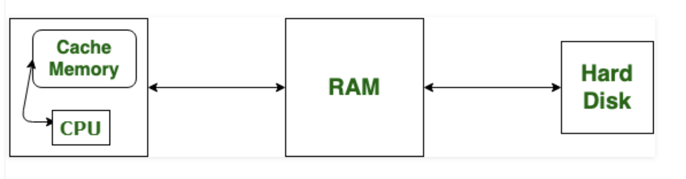
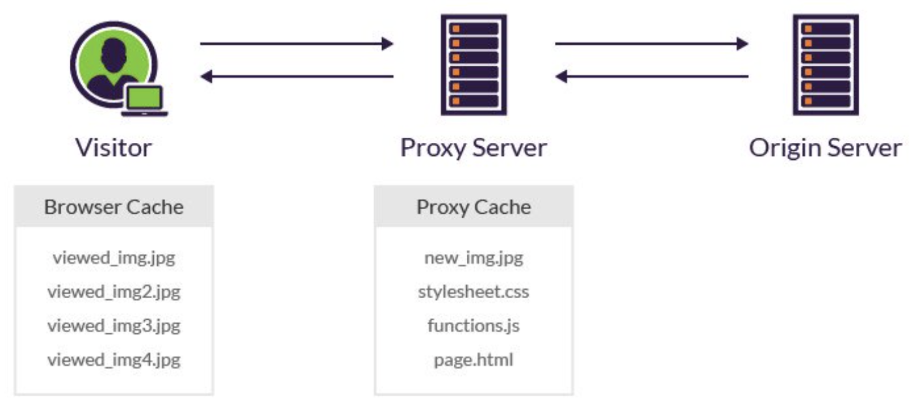
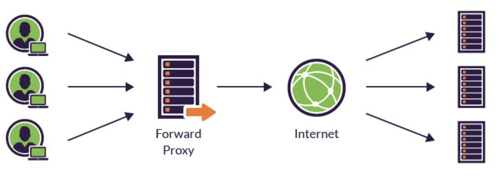
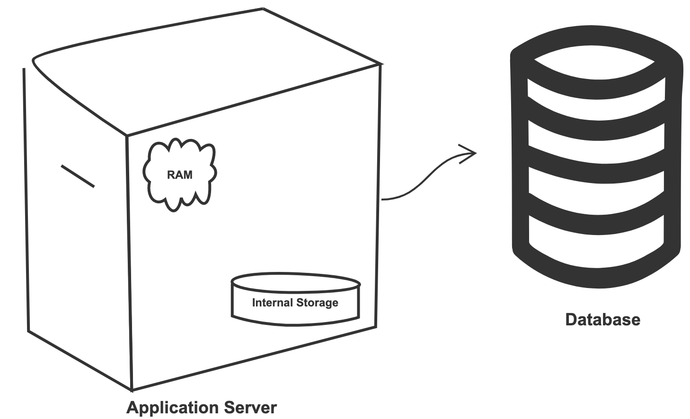
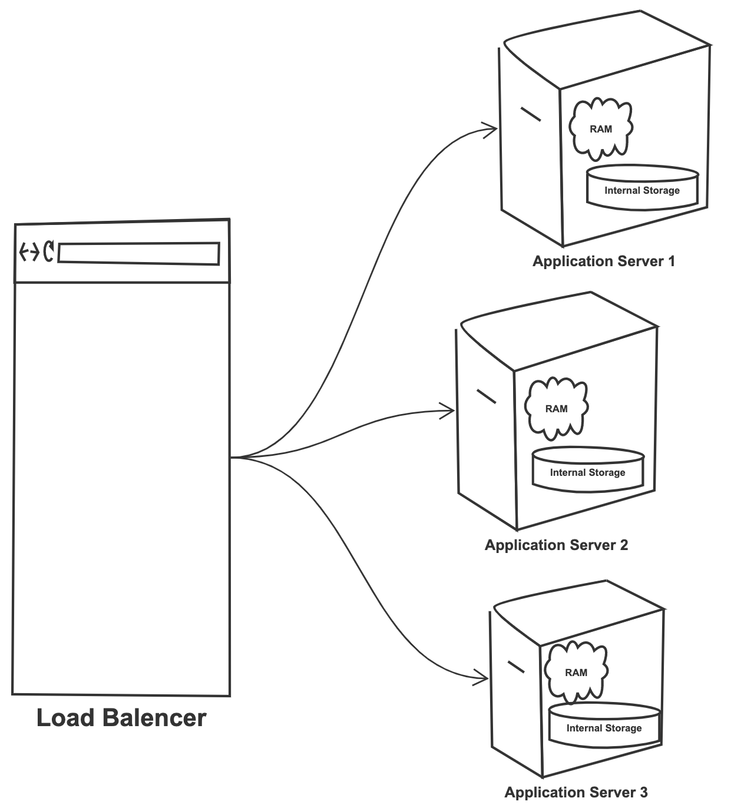
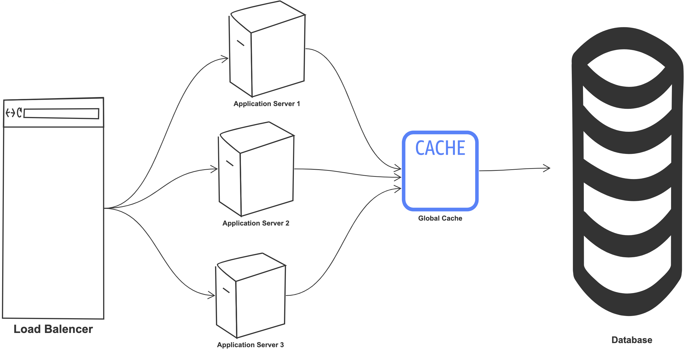

<h1>Cache</h1>
<h2>Goal</h2>
    
Improves page load time and reduces the load on your server and database.
 

<h2>Types of caching</h2>
    <h3>Client Side caching</h3>
    
   <ul>
        <li>Operatig system Cache
            
<b>Note: </b>RAM is not cache, it's just used to store the programs and data being used by the CPU in real-time. 
            It is a hardware component.

            
        </li>
        <li>Browser Cache
            
Involves a visitor’s browser downloading your website’s resources, (e.g., HTML files, JavaScript files and images) to their local drive.

            
<b>Note: </b>Cookies are different, they are employed to store user choices such as browsing session to trace the user preferences.

        </li>
        <li> Proxy Server Caching 
            
<b>Note:</b> Only reverse proxy uses proxy server caching, forward proxy does not use proxy server caching. 
            The below information about reverse and forward proxies is for your information only.
            

            
Traditionally, I wouldn't calssify Proxy server caching as 'Client side caching' but, it's still nearer to client side and not all the way at the server side.

            <ul>
                <li>Reverse Proxy (or CDN):
                    
Website resources are stored in intermediate servers (CDN), instead of your visitor's local drives.

                    
For example, when a visitor accesses a blog with a header image, the proxy server looks for the image in its cache. 
                    If it’s the first time that the image is accessed, the server needs to request it from the origin. 
                    The next time the article is accessed from the proxy server – by <u>any visitor</u> – the image will already be available in the proxy cache.
                    

                    
                </li>
                <li> Forward Proxy:
                    
The most common example of forward proxy is VPN used by your school or work.
                    Forward proxy is placed between user and internet, it regulates incoming and outgoing traffic.
                    

                    
            </ul>      
        </li>
   </ul>

   <h3>Server Side caching</h3>
   
   <ul>
   <li> Database Caching:
       
Helps your primary DB by removing the load from it. 
       You can keep frequently accessed data in this cache. 
       Rather than scavenging for data, you can first check if it’s present in the cache or not.
       

   </li>
   <li> Application server caching:
       
Placing cache on app server can help fetch response quicker.

       
The App server has RAM and internal storage (Just like your computer). 
       Obviously, RAM is very fast but internal storage can be much quicker than going to an external DB server and fetching data from there.
       

       
So we can first check if the requesed data is present on app server, if not then we can go to the external DB and fetch it.

       
       
But what happens when you start to scale the system and have many App server nodes ?

       
Those individual app servers can still have their own caches, but if your load balancer distributes the load unevenly, then requests can go to different app servers and this will increase cache misses.

       
       
To overcome this hurdle we can use <b>Global caches</b>

       <ul>
       <li>Global Cache:
           
You can have a global cache for all servers. (Can use Redis for this)

           
One big advantage of global cache is that you can scale it independently 

           
       </li>
       </ul>
   </li>
   </ul>