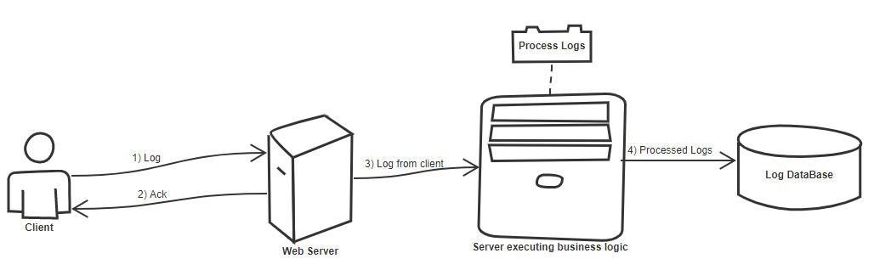
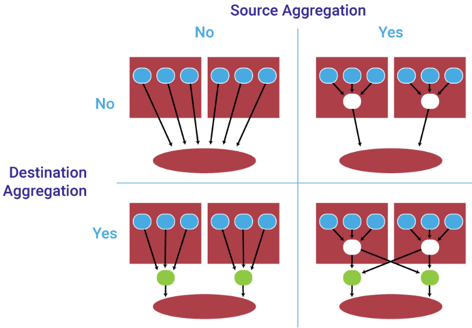

<h1><a href="https://medium.com/netflix-techblog/scalable-logging-and-tracking-882bde0ddca2">Netflix's logging system</a></h1>
<h2>Goals</h2>

<ul>
<li>
Building a service that collects data from the users.
</li>
<li>
Has low latency  
(don't disturb the user while collecting the data)
</li>
<li>
Ok to compromise on consistency 
(the data being collected is non-critical, so we can drop the data instead of collecting each and every piece of data and giving trouble to the user)
</li>
</ul>

 

<h2>Scope</h2>

We are building a service that: 
Handles billions of requests a day. 

 

<h2>Capacity estimation</h2>

The log size from client is about 16KB 
Server response size is about 512bytes 

 

<h2>High Level Design Diagram</h2>

 

<h2>Detailed component design</h2>
<h3>How do we achive low latency? </h3>

As you can see in the diagram, as soon as we get the log we free up the request by sending it Ack. 
Also, as soon as we see some faliure case, don't do any processing, just take the log and return, process the log later in back end.  

 

<h2>Scale the system</h2>
To scale this, we can have multiple deployments of this cluster. 
 
<b>Pros of single cluster:</b> 
Single deployment 
One place to manage / track  
 
<b>Pros of multiple deployment:</b> 
No single point of faliure  
Can scale up/down independently, so one cluster doen't have to be dependent on another  
Easy to debug 
 
Something like this  

