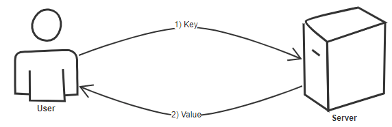
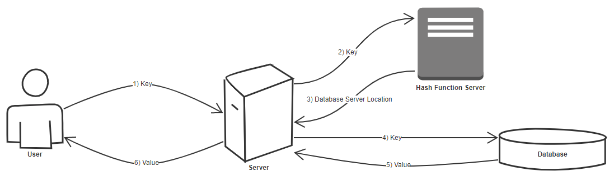
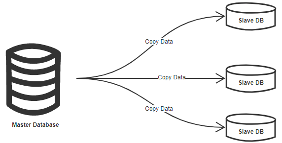

<h1>Key Value Store </h1>
<b>What is a key value store ?</b> 
The most simple answer is Hash Table.  
<b>Drawbacks:</b> 
What if the data is too big and cannot fit in memory ?  
<b>Answer:</b> 
Distributed key value storage system.
  

<h2>Goals</h2>
Design a distributed key value sotrage system. 
Take in a key and return value.  
Make sure your system is: 
1) Highly available, and  
2) Consistant  
 
<b>Questions to ask the interviewer:</b> 
<ol>
<li>
What type of data am I storing here ?
<ol>
<li>What data type is the key and what data type is the value ?</li>
</ol>
</li>
<li>How much data am I storing ?</li>
<li>How frequently will the data be accessed ?</li>
<li>Is the traffic evenly distributed ? </li>
<li><u>Is this a read or a write heavy system ?</u></li>
</ol>
  

<h2>Scope</h2>
How many people will be using it ? 
1 Million
  

<h2>Capacity Estimations</h2>
How many requests per second at worst time ? 
1 request per second.
  

<h2>High Level Design</h2>

  

<h2>Detailed Component Design</h2>
When you say distributed key value store, it means the data is distributed. 
 
<b>Question:</b> How do you store distributed data ? 
<b>Answer:</b> Sharding  
 
<h3>Sharding</h3>
<b>Rule:</b> We need even distribution of data.
  
<ol>
<li>Range Based partitioning 
Store all the data starting from letter A on one shard etc. 
<b>Cons:</b>  
Produces inconsistency, one shard can grow bigger than another.  
What if one shard becomes hot ?  
</li>
<li>
ID/Hash-Key Based Partitioning 
Run the key through some sort of hash function, this gets you some id  
Based on this ID we can store the values. 

</li>
</ol>
  

<h2>Scale the system</h2>
<h3>System availability</h3>
 
Master can have latest and slaves can copy from master. 
If master goes down, one of the slaves becomes the new master. 
  
<h3>Consistency</h3>
The reads can be done from master.  
The writes can be done to one of the slaves.  
Then after some time period, we make this most updated slave the new master. 
And the original master now becomes the slave. 
The master slave architecture should be such that the slaves continuously copy off the master, so when we change the master, the slaves should be now copying off the new master. Thus making them also updated. 
This approch will compromise the latency of the most consistent data. 
  
<h3>Cache</h3>
We can put the most accessed data in LRU cache on the server.
  
<h3>Cluster</h3>
As the data grows and the customers grow, we'd eventually need to split the architecture into multiple clusters.  
We can use consistent hashing to add or remove the servers.  
Since we have decided to shard based on hashId, and if we decide to add more servers, this approch of load balencing would make sense 
