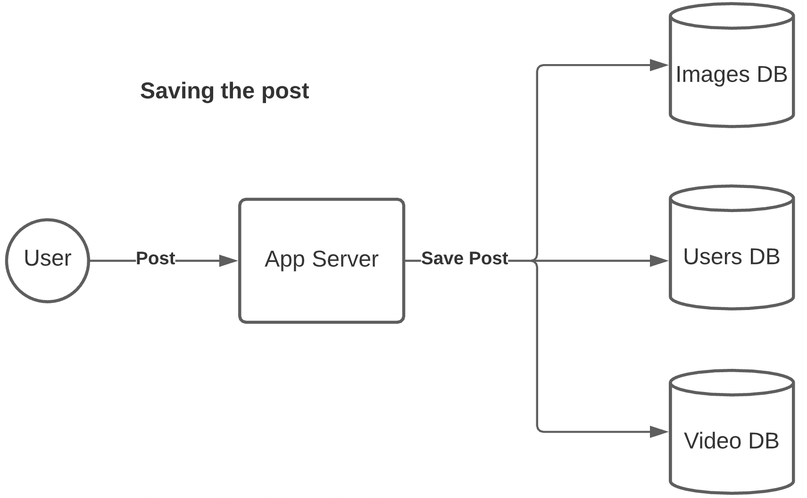
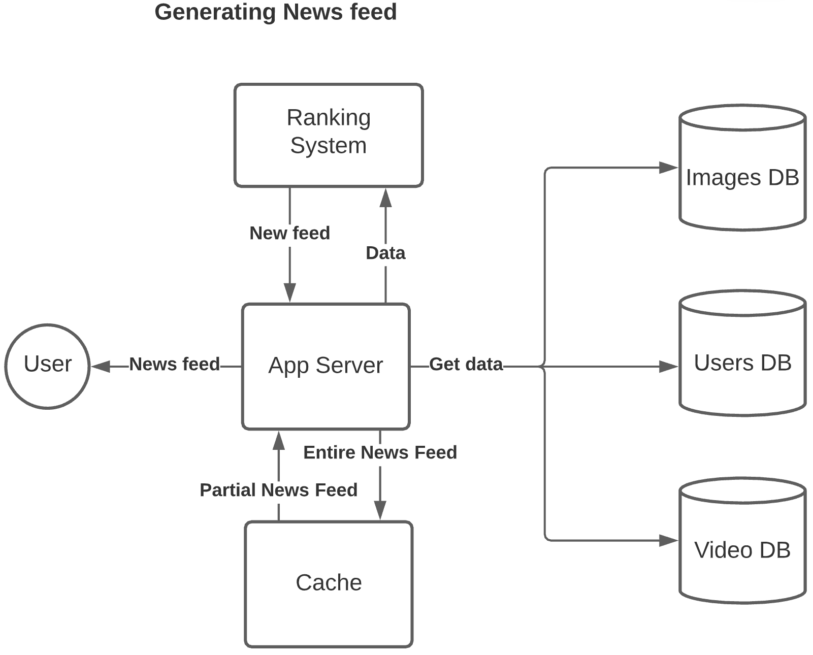
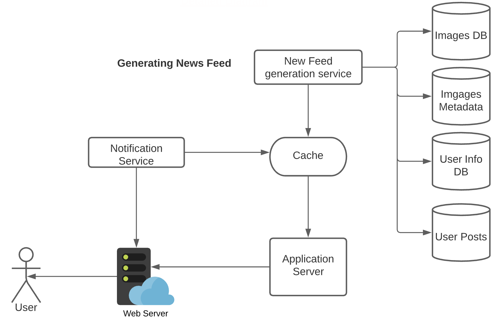

<h1>News Feed</h1>
    <h2>Requirements</h2>
        <ol>
            <li>Generate News Feed based on people a user follows</li>
            <li>A user may have many friends</li>
            <li>Feeds may contain videos, images, text</li>
            <li>When new post arrives, append it to the user's timeline</li>
            <li>We need a fast system, so low latency</li>
        </ol>
    <h2>Scope: Multi User, Probably 10 Users</h2>
    <h3>Class Design</h3>
        

        <b>User Class</b> {  
        Name: String  
        Id: int  
        email: String  
        Friends: [List of user Ids]  
        Posts: [List of Post Objects]  
        }
        

        

        <b>Post Class</b> {  
        Id: int  
        timestamp: Date  
        Content: String  
        Img attachemtns: Storage Url  
        Videos: storage url  
        }
        

    <h3>API Design</h3>
        

        <b>Get_Latest_User_Posts</b>(UserId, number of posts)
        

        

        <b>Generate_newsfeed</b>(userId, Number of posts, How many hours of data)
        

        

        <b>Post_Content</b>(UserId, PostObject)
        

    <h2>Scope: 100,000 Users</h2>
        <h3>High Level Diagram</h3>
        
         
        
    <h2>Scope: 1M Users</h2>
            <h3>Detailed Diagram</h3>
                
            <h3>News Feed Generation Service</h3>
                <h4>Approach 1:</h4>
                    

                    As soon as the user logs in we go find all his friends get their latest posts,
                    put them in ranking service and generate the news feed.
                    

                    
 <b>Problems with this approach:</b> 

                    <ul>
                        <li>What if a user has many friends ? Then this operation is slow.</li>
                        <li>Since we are performing this operation after the user logs in, it will take time.</li>
                        <li>When a user posts a status, we then have to notify all his friends immediately, this will create huge backlogs and heavy load on the server.</li>                       
                    </ul>
                <h4>Approach 2:</h4>
                
We generate the news feed offline and keep it in memory. The news feed is generated on regular basis.
                When a user requests their feed, we just fetch it from memory. 
                
    
            <h3>Post Publishing Service</h3>
                <h4>Approach 1:</h4>
                    
Publish the post as soon as the user posts something.

                    
<b>Pros:</b> 
                    Less read requests from DB.
                    

                    
<b>Cons:</b>
                    But what about user with millions of friends ?
                    

                <h4>Approach 2:</h4>
                    
Let the users request news feed items.

                    
<b>Pros:</b>
                    If the user has lot of friends, since we are not actively publishing data, we have less network load.
                    

                    
<b>Cons:</b>
                    What if there was no data published ? then the pull request will fetch empty result. 
                    That means we went all the way to server to get nothing.
                    

                <h4>Approach 3: Hybrid Model</h4>
                    
If it's a celeb we ask their followers to request data with pull approach. 
                    We can keep the celeb data in cache so we don't have to go all the way to the server if there are no updates.
   
                    
If the user has less friends, we can use push approach, where as soon as they publish a post we send it to their friends.
 
                    
We can also use the notification service to notify the users that there are new posts available to pull from.

                    
    
    
    
    
    
    