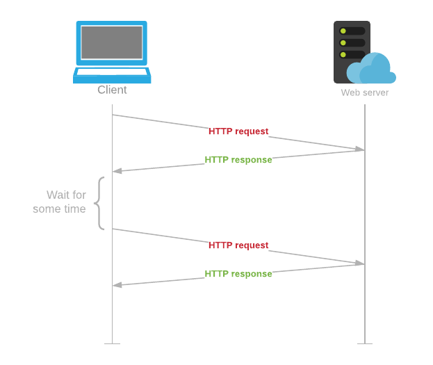
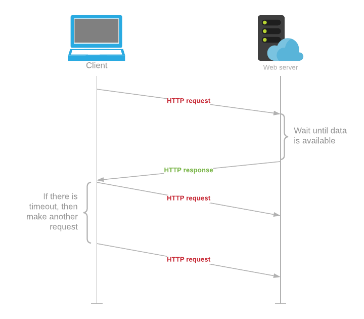
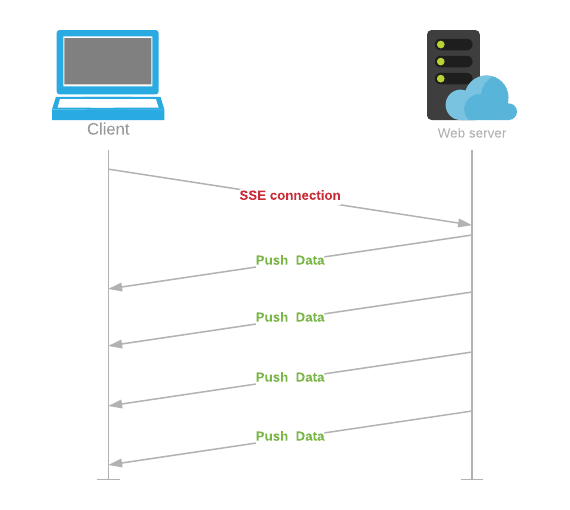
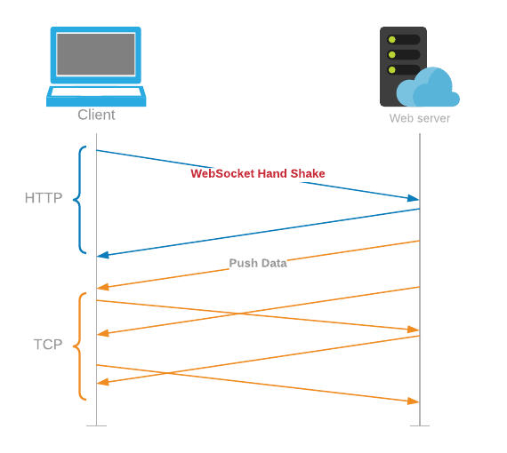

<h1>Polling</h1>
  
Polling is the process where the client (web browser), makes an HTTP request to the server, which sends back the appropriate response.

  <h2>Short Polling</h2>
    <ol>
      <li>The client sends a HTTP request to the server requesting information.</li>
      <li>The server, if it has any information sends it back.</li>
      <li>The client then waits for some time and repeats the above two steps again.</li>
    </ol>
    
The problem with Polling is that the client has to keep asking the server for any new data. As a result, a lot of responses are empty, creating HTTP overhead.

    
  <h2>Long Polling</h2>
    <ol>
      <li>The client opens a TCP tunnel and sends a HTTP request to the server requesting information.</li>
      <li>The server waits until there is new information available and then sends the response back.</li>
      <li>After receiving the information the client immediately makes another request and repeats the above two steps.</li>
      <li>If the server doesn’t have any new data and the long polling request times out, then the client has to make another request.</li>
    </ol>
    
The server has to handle the case where it gets new information to send, but the client hasn’t sent a new request yet.

    
The HTTP long polling mechanism can be applied to either persistent or non-persistent HTTP connections. The use of persistent HTTP connections will avoid the additional overhead of establishing a new TCP/IP connection [TCP] for every long poll request.

    
  
<h1>Server Sent Events (SSE)</h1>  
  
In this process, the server establishes a one way, long term connection with the client. Only the server is allowed to push data to the client. If the client wants to send data to the server, it needs to use another technology/protocol to do so.

  
This way the client can send data to the server, without having to re-establish a connection every time.

  <ol>
    <li>The client requests for a new SSE connection. </li>
    <li>The server registers the new SSE connection.</li>
    <li>The server begins pushing new data to the client.</li>
    <li>Either sides are allowed to close the connection.</li>
  </ol>
  
The main benefit of SSEs is it provides an efficient one directional data stream where the client and server don’t need to constantly reestablish the connection.

  
  
<h1>WebSockets</h1>
  
It is a two-way message passing protocol based on TCP. WebSockets are faster for data transmission than HTTP.

  <ol>
    <li>The client establishes a WebSocket connection with the server, through a process known as the WebSocket handshake.</li>
    <li>The messages are transmitted in both directions over port 443.</li>
    <li>Either side can close the connection.</li>
  </ol>
  
The main advantage of WebSockets is speed: the client and server don’t have to find and reestablish their connection with each other every time a message is sent.

  
TCP ensures that the messages will always arrive in order.

  
The main downside of WebSockets is it takes a good amount of initial developer work to implement. 

  
  
An example where WebSockets is really useful is multiplayer online gaming, 
  
  