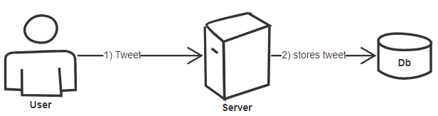
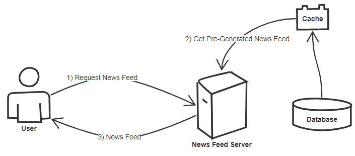
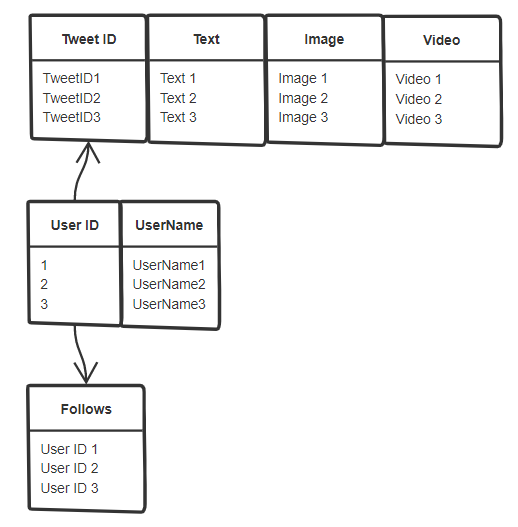
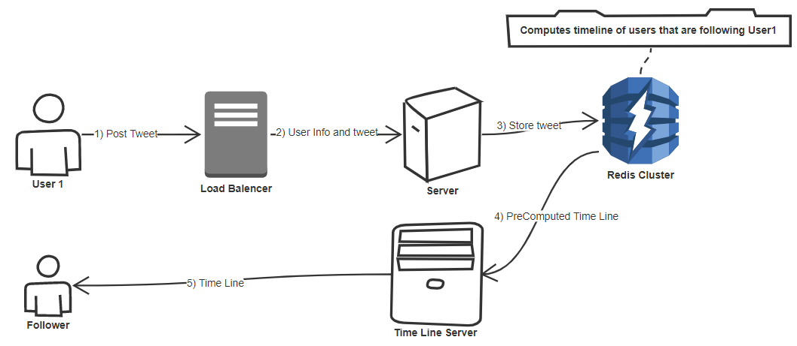
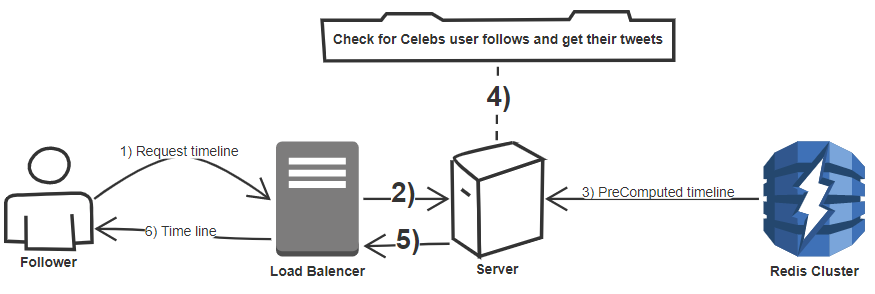

<h1>Design Twitter</h1>
<h2>Goals</h2>
<ol>
<li>
User should be able to:
<ol>
<li>Post a new tweet</li>
<li>Follow other users.</li>
<li>Like a tweet</li>
</ol>
</li>
<li>
Create a Time Line for:
<ol>
<li> Home Time Line/ News Feed: That consists of top tweets from the users our current user follows.</li>
<li> User Time Line: That consist of top recent tweets our user has made</li>
<li> Search Time Line: That consists of tweets based on a search term</li>
</ol>
</li>
<li>
The system needs to be:
<ol>
<li>Highly available</li>
<li>Can have some latency</li>
<li>Can take a hit on consistency</li>
</ol>
</li>
</ol>
  

<h2>Scope</h2>
Let's first desgin a system for 1 user for now.
  

<h2>Capacity Estimations</h2>
Let's have some assumptions 
100 Million total Users 
200,000 active users 
100,000 tweets per day 
On average 1 user follows 200 other users 
 
<b>Liked tweets</b> 
1 user likes 5 tweets per day 
200,000 users will like 10,00,000 tweets per day.
  
<b>Tweet Views</b> 
Let's say the timeline of any user has at max 10 tweets. 
Our current user visits their timeline 2ce a day and also visits 5 other people's timelines 
So total timelines the current user sees is 7 
And as stated above that each timeline consists of about 10 tweets 
So total tweets = 70 
And we have about 200,000 active users 
So total tweet views is 200,000*70 = 140,000,000  
 
<h3>Storage Estimations</h3>
What does our tweet consist of ? 
1) Text (max 140 chars) 
2) Image/video  
3) other metadata like timestamp, tweet id etc. 
<b>Pure Text tweet without Image/Video</b> 
Let's say we need about 300 bytes to store the text 
And about 50 bytes to store metadata. 
So 1 pure text tweet size is: 300 bytes + 50 bytes = 350Bytes 
<b>Text+Image tweet</b> 
Let's say we need about 300 bytes to store the text 
And about 50 bytes to store metadata. 
And 200KB to store the image 
So 1 Text+Image tweet size is: 300 bytes + 50 bytes + 200KB = 200.35KB 
<b>Text+Video tweet</b> 
Let's say we need about 300 bytes to store the text 
And about 50 bytes to store metadata. 
And 2MB to store the video 
So 1 Text+Image tweet size is: 300 bytes + 50 bytes + 2MB = 2.00035MB 
<b>Total Storage Per Day</b> 
Let's say we have 20% tweets that contain Images and 10% tweets contain Videos 
So out of 100,000 we have 20,000 tweets with images and 10,000 tweets with videos and rest 70,000 pure text tweets. 
Total storage required would be: 
70,000*350Bytes+20,000*200.35KB+10,000*2.00035MB = 24.03500 GB  
 
<h3>Bandwidth Estimations</h3>
So if 24GB per day then 24GB/24Hours = 1GB per hour, 1GB/60Mins*60Seconds per second
  

<h2>High Level Design</h2>
<h3>Post Tweet</h3>

  
<h3>Get News Feed</h3>

  
<h3>General system analysis</h3>
We saw from Capacity Estimations we get 100,000 tweet writes per day but 140,000,000 tweet views per day. 
So our system is <u>READ HEAVY</u>  
  

<h2>Code</h2>
<h3>Classes</h3>
<b>Tweet</b> 
UserId (who created the tweet) 
TweetID 
Text 
Image 
Video 
TimeStamp 
FavouritedBy = [List of UserID] (users that have marked this tweet as their favourite) 
 
<b>User</b> 
ID 
UserName 
Follows = [List of UserIDs] 
FavouriteTweets = [List of TweetIDs] 
  
<h3>API</h3>
<b>CreateTweet(UserId, Text, [Optional]Image, [Optional]Video)</b>  
Creates a tweet object 
Returns success if a tweet object is created successfully 
<b>PostTweet(TweetObject)</b> 
Returns success if the tweet is posted successfully 
  

<h2>Detailed Component Design</h2>
<h3>Post Tweet</h3>

Generally the user has 1:Many relationship, when it comes to tweets and followers. 
The above tables explain this. 

<b>Redis Database</b>: Redis is in memory database, it has key value pairs kinda like hash table. It offers data replication. 
So in our above diagram the data is replicated 3 times in the Redis cluster  
It is very easy to insert huge amounts of data easily 
 
<b>Bottleneck of the above approch</b> 
Every time the user tweets the data is getting replicated 3 times, so what about hot users like celebs ?  
To solve this problem, we can merge celeb tweets at load time of timeline. 
So every time user tweets, all their follower's time line gets pre computed. 
When the follower accesses their time line, during the access time, if the follower is following celeb that time the tweet is loaded. 

