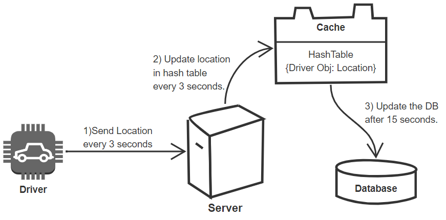
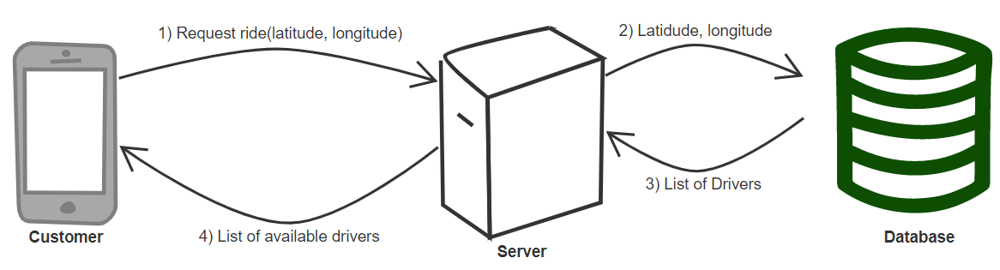
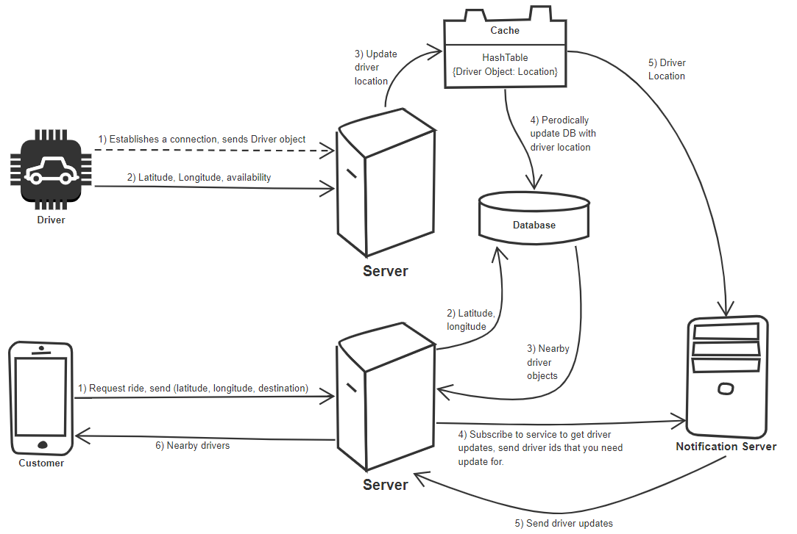
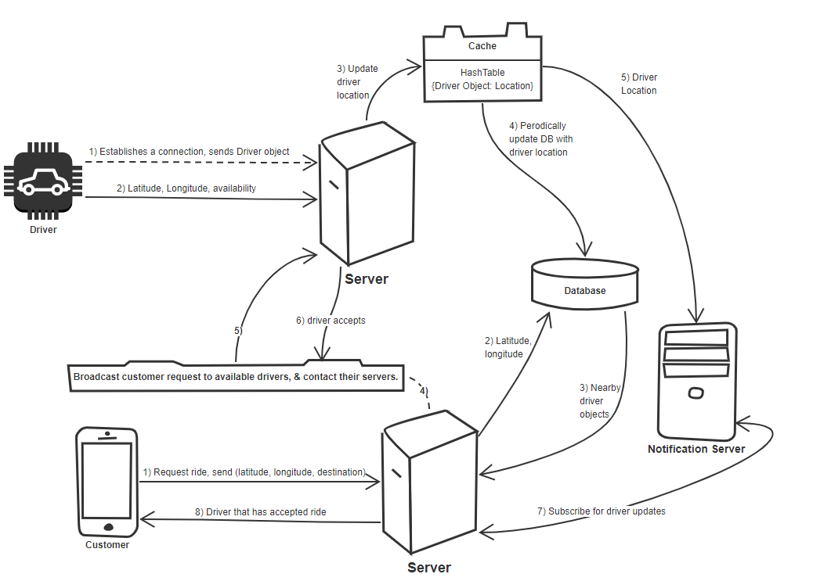

<h1>Uber Backend</h1>

<h2>Goals</h2>
Create 2 users:
<ol>
<li>
Drivers 
<ol>
<li>Drivers need to constantly update their location, possibly every 3 seconds. </li>
<li>They need to notify server that they are ready to pick up a passenger.</li>
</ol>
</li>
<li>
Customers 
<ol>
<li>Can see the near by drivers.</li>
<li>Request a ride.</li>
</ol>
</li>
</ol>
When a customer requests a ride, all the nearby available drivers are notified. 
The first driver to accept the ride gets that customer.
  

<h2>Scope</h2>
For now let's have multiple drivers and 1 customer.
  

<h2>High level design</h2>
<h3>Driver Side</h3>

<h4>API</h4>
<b>UpdateLocation(Driver Object, latitude, longitude, availability)</b>
  
<h3>Customer Side</h3>

<h4>API</h4>
<b>RequestRide(Customer Object, srcLat, srcLong, destLat, destLong)</b> 
srcLat = Source Latitude  
srcLong = Source Longitude  
destLat = Destination Latitude  
destLong = Destination Longitude  
  

<h2>Detailed component design</h2>
<h3>Sending details of nearby drivers </h3>

 
<b>How much space would our driver HashTable need ?</b> 
Currently my hash table stores the driver id and new latitude and longitude. 
So if my driver id is let's say 3bytes and latitude and longitude are 8bytes each then total space for 1 driver would be 3+8+8 = 19bytes. 
<b>How much bandwidth would we require to update the hash table ? </b> 
We are getting 19 bytes every 3 seconds per driver. 
 
In both cases I haven't mentioned what would be the total space/bandwidth, I have only mentioned for 1 driver. You take this 1 driver and multiply with what ever number the interviewer gives you. Based on this new number you can say ok may be I require more server or may be my current server can handle more requests. 
 
<b>Do we repartition the grid every time the number of drivers grow and the grid reaches it's capacity? </b> 
We can have some sort of cushioning, like we can allow an extra 10% growth before partitioning the grid. 
 
<h3>Request a ride</h3>

  

<h2>Bottlenecks</h2>
What if the notification server fails ?  
Hash Table cash for drivers can grow a lot in size, how would you tackle that ?  
