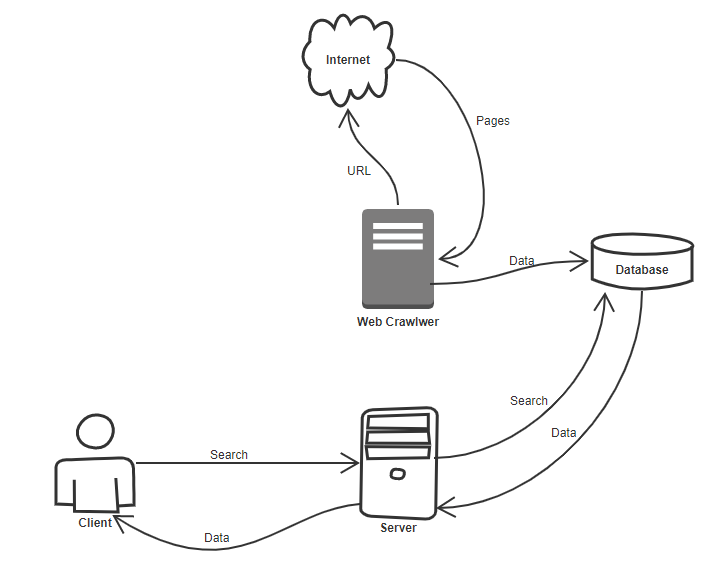
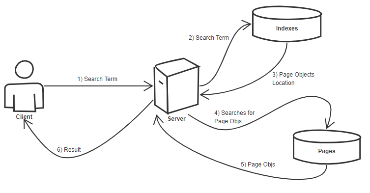

<h1>Design a web crawler</h1>

<h2>Use Case</h2>
<ul>
<li>Given a URL your application crawls it</li>
<ul>
<li>What do you mean by crawling ?</li>
<content> The crawler goes to each and every link on a given page and collects all links on that page. </content>
</ul>
 

<li>Reverse indexes pages based on key words</li>
<ul>
<li> What is reverse indexing ?</li>
<content>
When the crawler is going through the webpage, it gets the keywords on that page, and then stores them. 
These key words are then used to find pages on the site when user performs a search.
</content>
</ul>
 

<li>Generate title of the page and a small snippet of the page.</li>
<content>
Something like this. 

</content>
 

<li>User searches a search term, gets a list of pages containing that search term</li>
 

<li>The system needs to be higly available.</li>
</ul>
 

    <h2>Constraints</h2>
    <ul>
        <li>Traffic is not evenly distributed</li>
        <content>May have some popular searches</content>
         

        <li>Need to have low latency</li>
        <content>Can we compromise on consistency ?</content>
         

        <li>Need to detect cycles</li>
         

        <li>Pages need to be crawled regularly to ensure freshness</li>
        <content>On an average 1ce per week</content>
    </ul>
     

    <h2>Scale</h2>
    <ul>
        <li>1 billion links to crawl</li>
         

        <li>100 billion searches per month</li>
    </ul>
     

    <h2>High Level design</h2>
    
     

    <h2>Indivudial component design</h2>
    <h3>Web crawler</h3>
    

    <h3>Class Design</h3>
    <pre><code>
        class Page(object):
            def __init__(self, url, title):
                self.title = title
                self.url = url
                self.timeStamp = DateTime.now()
                self.childUrls = []
        </code></pre>

    <h2>Determining when to update the crawl results</h2>
    
We can have another micro service that perodically updates all the crawled pages thus updating timeStamp. 
    This service can update both pages and indexes database.
    

     

    <h2>User inputs a search term and sees a list of relevant pages with titles and snippets</h2>
    
     
