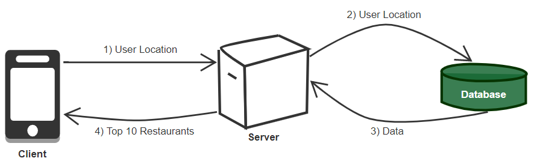

<h1>Design Yelp or nearby things</h1>
 

<h2>Goals</h2>
<ol>
<li>
Given location of the user return the top 10 "things" aroung the user. 
For simplicity, things = restaurants. 
</li>
<li>
The restaurants should be within 2 mile radius of the user.
</li>
<li>
The users should be able to add/delete/update the restaurant information.
</li>
<li>
The users should be able to add comments/feedback/review about the restaurant.
</li>
<li>
The result should have minimul latency.
</li>
</ol>
 
<b>Too long didn't read:</b>
 
<u>Input:</u> User location in latitude and longitude
 
<u>Output:</u> Top 10 restaurents around user within 2 mile radius.
  

<h2>Scope</h2>
For now let's design this for one user. 
We are assuming that the restaurent data is already populated. 
  

<h2>High Level Diagram</h2>
<h3>Search restaurant</h3>

  

<h2>Code</h2>
<h3>API</h3>
<b>Search(user object, latitude, longitude)</b>
 
Returns: Top 10 Restaurant objects.
 
The mobile client can then render these objects into list that the user can add comment/feedback to.
  
<h3>Classes</h3>

  

<h2>Detailed component design</h2>
The main crux of the problem is, how do we store this data and how do we retrieve it. 
<h3>Trees</h3>

You can store the world map in a tree like structure like R-Tree, Quad tree.
I am gonna be discussing about quad trees here. 
<b>Quad Tree</b>
 
You take the globe and divide it into 4 quadrants. 
Then you further take each quadrant and divide it into 4 more quadrants.  
So densely populated areas will have more rectangles on it, and sparsely populated areas will have less rectangels over it. 
 
For simplicity let's assume the most desely populated area has grid size of 2 miles by 2 miles. 
Further more, the leaf nodes can be connected so we can easily search over large areas. 
So for below use case: 
 
Since the leafes are connected all we'd need to do is fetch the appropriate result from each leaf node. 

The leaf nodes have the Ids of the restaurants contained within that grid locaiton. 
So when the user requests for the information, we can query the resulting leaf nodes, get the restaurents and perform the K nearest point algo on those restaurents to get our top 10 list. 
<b>Insert</b> 
So to insert a restaurant, we find the appropriate leaf node and add the restaurant ID in it. 
Let's say the max capacity a leaf can hold is 200 restaurant Ids and we reach that, then we split the leaf node into 4 quadrants and put appropriate restaurents in each new leaf. 
 
With this approch both insert and search would be log(n) time.
  

  

<h2>Scale the system</h2>
<h3>Sharding</h3>
What if the entire quad tree cannot fit in memory? 
 
<h4>Region Based Sharding</h4>

<b>Drawbacks:</b>  
What if one region becomes hot ?  
What if one region contains more data than other ?  
 
<h4>Grid Id based sharding</h4>
We can fit grids on the database, instead of specific location. 
 
Both the sharding approches are similar, but with grid id we are fitting the quadrants on database instead of city or state. 
  
<h3>Data Replication</h3>
We can have master slave architecture to ensure availability. 
<b>Reads:</b> The reads can be done from the master. 
<b>Writes:</b> The writes can be done to one of the slave, and after some time period we can make this slave the master, so other slaves can copy data off of this new master. 
  
<h3>Cache</h3>
To deal with hot Places, we can introduce a cache in front of our database.
  
<h3>Load Balencing</h3>
We can add Load Balencer in following 2 places:  
1) Between Clients and Application servers 
2) Between Application servers and Dababase server.
