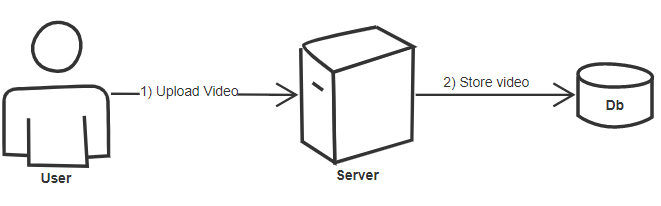
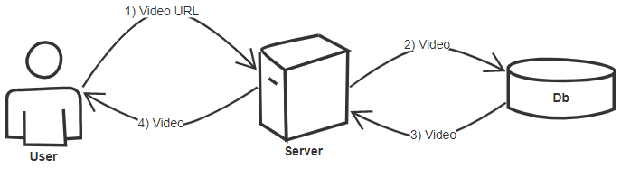
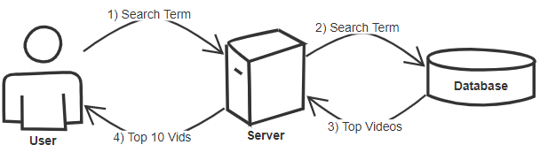
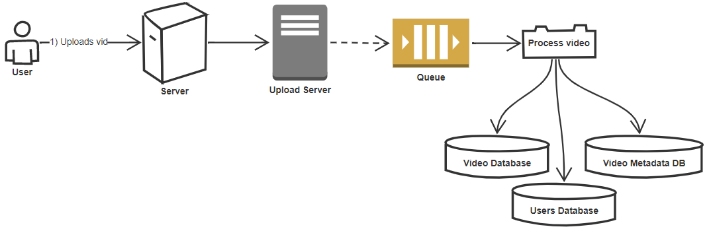
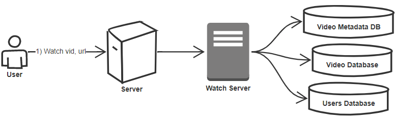
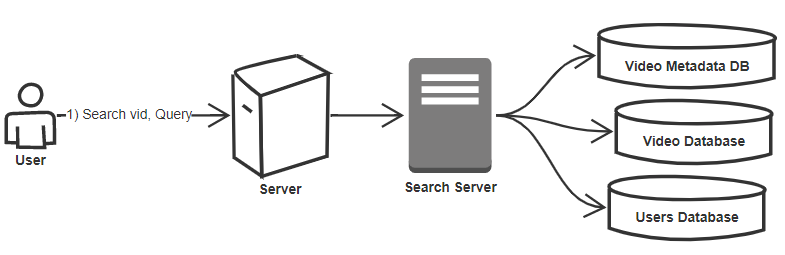
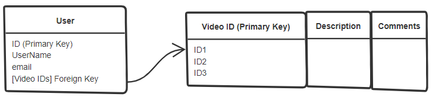

<h1>Design a video sharing service like Youtube or Netflix</h1>
<h2>Goals</h2>
1) Upload a video 
2) View a video 
 
3) Search for a video 
4) Capture stats like, comments, likes, views on a video. 
 
5) System should be highly available 
6) System should be hightly reliable 
7) System can take a hit on Consistency 
  

<h2>Scope</h2>
Let's design this system for multiple users.  

<h2>Capacity Estimations</h2>
Our system is read heavy.   
Let's have 5 Million active users. 
 
Let's assume that 1 user views about 5 videos per day 
Thus total video views 5*5 Million = 25 Million views per day. 
 
Let's assume there is 1 video uploaded per second. 
 
<b>Upload Storage Estimations</b> 
Let's assume per minute we get about 1 hour worth of video data 
Let's assume the size of 1 hour of data is 1 GB 
Per day we'd need 60 Min* 24Hour = 1440GB 
 
<b>Upload Bandwidth Estimations</b> 
Since we are getting 1 hour of video data per min. 
That is 60 mins of data per min 
And if we can upload 10MB per min. 
We'd need to upload 60*10MB = 600MB per min 
 

<h2>High Level design</h2>
<h3>Upload Video</h3>

  
<h3>Watch Video</h3>

  
<h3>Search Video</h3>

  

<h2>Code</h2>
<h3>Classes</h3>
<b>User</b> 
ID 
UserName 
VidsUploaded = [List of vid ids] 
HistoryOfVidsWatched = [List Of Vid Ids] 
Subscription = [List Of User ID] 
 
<b>Video</b> 
ID 
Title 
Description 
Comments = [List Of Comment Objects]  
Video = Location of vid file 
Thumbnail = Location of image 
UserID (user who uploaded this video)  
Date and time of creation  
Total Number of views 
Total number of Likes 
 
<b>Comment</b> 
ID 
Text 
UserId (who created the comment)  
VidId (Where the comment was left)  
  
<h3>APIs</h3>
<b>UploadVid(user object, vid object, vid Content)</b> 
vid content = the video stream 
Returns: Success if the video was uploaded successfully 
 
<b>WatchVid(user Object, vid url)</b> 
Returns: Stream of vid requested 
 
<b>SearchVid(user object, search term)</b> 
Returns: top 10 vid objects 
 
Note: instead of user object, we can send user api key. 
We can eliminate the hacker attacks if we send the api key.  
So if we decide to send the api key then APIs would look like this 
<b>UploadVid(apiKey, vidStream, title, description, timeStamp)</b> 
<b>WatchVid(apiKey, vidUrl)</b> 
<b>SearchVid(apiKey, searchTerm, [optional]VidCountToReturn)</b> 
  

<h2>Detailed Component Design</h2>
There are 3 components to this system. 
<h3>Upload</h3>

 
<h3>Watch</h3>

 
<h3>Search</h3>

 
Reason why I have 3 different databases for user content, video content, metadata content is because there are 3 different data types here. 1) videos 2) Text/objects (for user data) 3) Image data (metadata may contain thumbnail images). 
So each database represents a storage system 
We can use different storage systems for different types of data 
Why are we doing this ? 
It’s recommended to store large static files like videos and images separately as it has better performance and is much easier to organize and scale.  
<h3>Database design</h3>
The service is read heavy. 
So we need to design a database server that can fetch content fast. 
For this purposes we use relational database 
The user to video relationship can be like this 

<b>Video storage system</b> 
For storing the video we can store it in a distributed file storage system. 
Now if you are in USA and you want to watch a video that is stored in Indian database server, it will take time for that video to load. 
So to avoid this issue we have CDN.(content delivary network) 
A CDN is system if distributed servers, that are distributed over geographic locations. 
The CDN server will host your content on their servers. So users instead of accessing content from the main server that may be far away from them, can instead access content from a server that's near to them physically. 
Advantage: your content is replicated (that means it has a backup) 
<b>But we have a lot of data !! can we replicate all of it on CDN servers ?</b> 
One straightforward approach is to host popular videos in CDN and less popular videos are stored in our own servers by location 
  

<h2>Scale the system</h2>
<h3>Sharding Metadata</h3>

